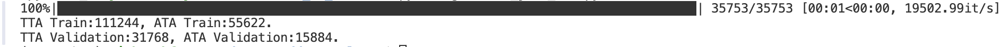
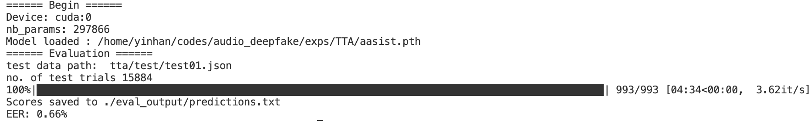

# EnvSDD
Official code for EnvSDD (Environmental Sound Deepfake Detection)

Arxiv: 

Abstact:
Audio generation systems now create very realistic soundscapes that can enhance media production, but also pose potential risks. Several studies have examined deepfakes in speech or singing voice. However, environmental sounds have different characteristics, which may make methods for detecting speech and singing deepfakes less effective for real-world sounds. In addition, existing datasets for environmental sound deepfake detection are limited in scale and audio types. To address this gap, we introduce EnvSDD, the first large-scale curated dataset designed for this task, consisting of 45.25 hours of real and 316.74 hours of fake audio. The test set includes diverse conditions to evaluate the generalizability, such as unseen generation models and unseen datasets. We also propose an audio deepfake detection system, based on a pre-trained audio foundation model. Results on EnvSDD show that our proposed system outperforms the state-of-the-art systems from speech and singing domains.

More information please refer to our demo page: https://envsdd.github.io/

## Dataset

Detailed structure of the dataset is shown in the following figure:

<p align="center">
  
</p>

- EnvSDD-Development: you can download from [https://zenodo.org/records/15220951](https://zenodo.org/records/15220951)
- EnvSDD-Test: you can download from [https://zenodo.org/records/15241138](https://zenodo.org/records/15241138)
- EnvSDD-Remain: available soon

Some parts of the dataset are temporarily not publicly available because we plan to host a challenge. We aim to ensure fairness and prevent data leakage prior to the event. The dataset will be made publicly available after the competition concludes. If you are interested in early access for research purposes or have any questions, please feel free to contact us at yinhan@mail.nwpu.edu.cn.
Thank you for your understanding!

## Development
- Step 1: prepare environment by running: <mark>pip install -r requirements.txt<mark>
- Step 2: prepare .json file for development by running: <mark>python generate_json_dev.py<mark>

<p align="center">
  
</p>

- Step 3: train your deepfake models by running: <mark>python main.py --exp_id 0 --model model_name<mark>

3 models are supported now: aasist, w2v2_aasist, beats_aasist.

PS: There are lots of arguments (eg. batchsize, eval ...) in the main.py, you can directly set in the terminal. It is ok if you do not have test.json during training, test.json will only be used when you activate "eval".

Pretrained models: we use two pre-trained models in the paper. We sincerely appreciate the tremendous efforts behind these outstanding works.

1. wav2vec XLS-R 300M: [https://github.com/facebookresearch/fairseq/blob/main/examples/wav2vec/xlsr/README.md](https://github.com/facebookresearch/fairseq/blob/main/examples/wav2vec/xlsr/README.md)

2. BEATs: [https://huggingface.co/nsivaku/nithin_checkpoints/tree/main](https://huggingface.co/nsivaku/nithin_checkpoints/tree/main)

## Test
- Step 1: prepare .json file for test by running: <mark>python generate_json_test.py<mark>

- Step 2: test your deepfake models by running: <mark>python main.py --exp_id 0 --eval --eval_output ./eval_output/predictions.txt --test_meta_json tta/test/test01.json --model aasist --model_path /home/yinhan/codes/audio_deepfake/exps/TTA/aasist.pth<mark>

<p align="center">
  
</p>

PS: we release our checkpoints in xxxxxx. At the moment we do not release the metadata of the test sets, so we report the models' performance on the validation set for reference (The performance on validation set is good because this is an in-domain inference, more results on out-of-domain tests can be found in our paper).

Table: Equal Error Rate (%) of different systems on the validation set. 
<div align="center">

|      System     |   TTA    |   ATA   |
|-----------------|----------|----------|
|      AASIST     |    0.80    |   0.19   |
|   W2V2-AASIST   |    0.27   |  0.25   |
|   BEATs-AASIST  |    0.09 | 0.06 |
<div>

<div align="left">

## Acknowledgements
Our implementations use the source code from the following repositories and users:

- [https://github.com/swagshaw/XLSR-Mamba](https://github.com/swagshaw/XLSR-Mamba)
- [https://github.com/ductuantruong/tcm_add](https://github.com/ductuantruong/tcm_add)
- [https://github.com/TakHemlata/SSL_Anti-spoofing](https://github.com/TakHemlata/SSL_Anti-spoofing)

## Citation
If you find our repository valuable for your work, please consider giving a star to this repo and citing our paper:
```
@article{envsdd,
  title={{EnvSDD}: Benchmarking Environmental Sound Deepfake Detection},
  author={Yin, Han and Xiao, Yang and Das, Rohan Kumar and Bai, Jisheng and Liu, Haohe and Wang, Wenwu and Plumbley, Mark D},
  booktitle={Interspeech},
  year={2025}
}
```

<div>