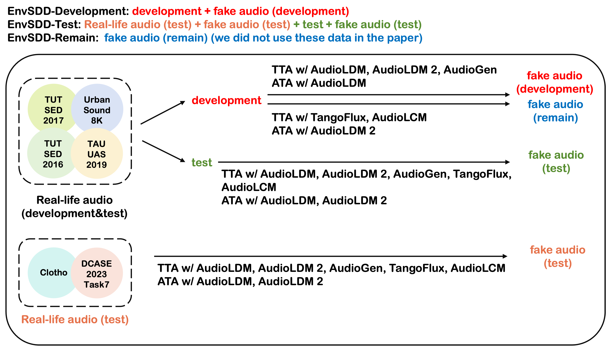

# EnvSDD
Official code for EnvSDD (Environmental Sound Deepfake Detection)

Arxiv: 

Abstact:

Audio generation systems now create very realistic soundscapes that can enhance media production, but also pose potential risks. Several studies have examined deepfakes in speech or singing voice. However, environmental sounds have different characteristics, which may make methods for detecting speech and singing deepfakes less effective for real-world sounds. In addition, existing datasets for environmental sound deepfake detection are limited in scale and audio types. To address this gap, we introduce EnvSDD, the first large-scale curated dataset designed for this task, consisting of 45.25 hours of real and 316.74 hours of fake audio. The test set includes diverse conditions to evaluate the generalizability, such as unseen generation models and unseen datasets. We also propose an audio deepfake detection system, based on a pre-trained audio foundation model. Results on EnvSDD show that our proposed system outperforms the state-of-the-art systems from speech and singing domains.

More information please refer to our demo page: https://envsdd.github.io/

## Dataset

In our work, we sourced real data from 6 public datasets: UrbanSound8K (D1), DCASE 2023 Task7 Dev (D2), TAU UAS 2019 Open Dev (D3), TUT SED 2016 (D4), TUT SED 2017 (D5) and Clotho (D6). 

For Text-to-Audio (TTA) deepfake, we use 5 TTA models, including: AudioLDM (G1), AudioLDM 2 (G2), AudioGen (G3), TangoFlux (G4) and AudioLCM (G5). For Audio-to-Audio (ATA) deepfake, we use 2 ATA models, including: AudioLDM (G1) and AudioLDM 2 (G2).

Detailed structure of the dataset is shown in the following figure:

  

- EnvSDD-Development: you can download from [https://zenodo.org/records/15220951](https://zenodo.org/records/15220951)
- EnvSDD-Test: you can download from [https://zenodo.org/records/15241138](https://zenodo.org/records/15241138)