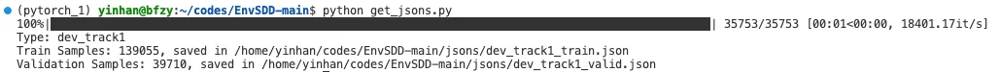
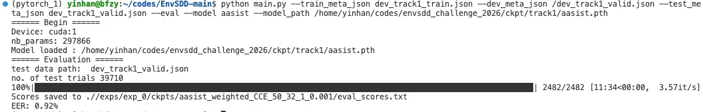
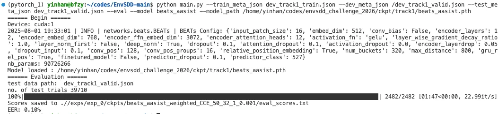
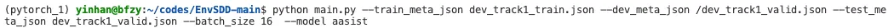
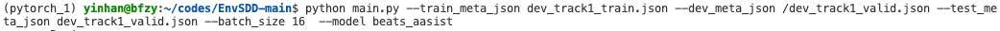
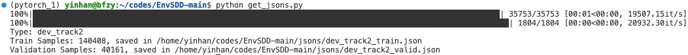
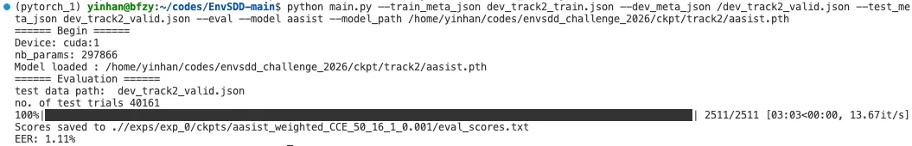
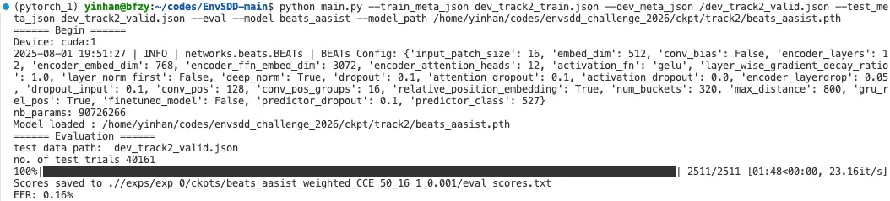
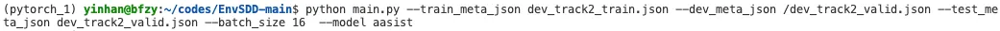
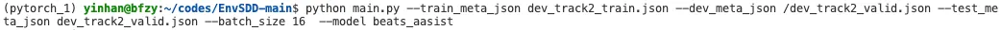

# ESDD (Environmental Sound Deepfake Detection) Challenge 2026 

Based on EnvSDD, we are launching the ICASSP 2026 Environmental Sound Deepfake Detection Challenge. To address the key challenges encountered in real-life scenarios, we have designed two different tracks: **ESDD in Unseen Generators (track 1)** and **Black-Box Low-Resource ESDD (track 2)**. Track 1 aims to explore the generalizability to unseen Text-to-Audio (TTA) and Audio-to-Audio (ATA) generators. Track 2 presents a more challenging scenario, simulating real-world deepfake detection under extreme uncertainty and limited data. Details about how to run the baseline systems for track 1 and track 2 are as follows.

More information please refer to [our challenge page](https://sites.google.com/view/esdd-challenge/description).

## Data and ckpt download

- Please download the development data for track 1 from [Zenodo](https://zenodo.org/records/15220951).

- Please download the development data for trakc 2, evaluation data for track 1&2 from [Zenodo](https://zenodo.org/records/16684355).

- Please download the challenge baseline checkpoints from [Zenodo](https://zenodo.org/records/16684054).

## Track 1: ESDD in Unseen Generators

### Prepare development json

Then, run the script *python get_jsons.py*, set *TYPE=”dev_track1”*, as shown in the figure:

  

### Evaluate AASIST on validation set

  

### Evaluate Beats_AASIST on validation set

  

### Train AASIST on development set

  

### Train Beats_AASIST on development set

  

When your model is ready, you can submit your inference results to [codabench](https://www.codabench.org/competitions/10014/). Then you can check the scores on evaluation/test sets. Please firstly register via [Google Forms](https://docs.google.com/forms/d/e/1FAIpQLSeRsxGOFihj7w6pw-IKDnLfUA0AuZRPuRO6YoH22FhemrZrTw/viewform), otherwise your registration for the codabenc will be NOT be accepted. Submitted file should be ".zip", examples for submission please refer to the folder **submissions**.

## Track 2: Black-Box Low-Resource ESDD

### Prepare development json

Then, run the script *python get_jsons.py*, set *TYPE=”dev_track2”*, as shown in the figure:

  

### Evaluate AASIST on validation set

  

### Evaluate Beats_AASIST on validation set

  

### Train AASIST on development set

  

### Train Beats_AASIST on development set

  

When your model is ready, you can submit your inference results to [codabench](https://www.codabench.org/competitions/10015/). Then you can check the scores on evaluation/test sets. Please firstly register via [Google Forms](https://docs.google.com/forms/d/e/1FAIpQLSeRsxGOFihj7w6pw-IKDnLfUA0AuZRPuRO6YoH22FhemrZrTw/viewform), otherwise your registration for the codabenc will be NOT be accepted. Submitted file should be ".zip", examples for submission please refer to the folder **submissions**.

